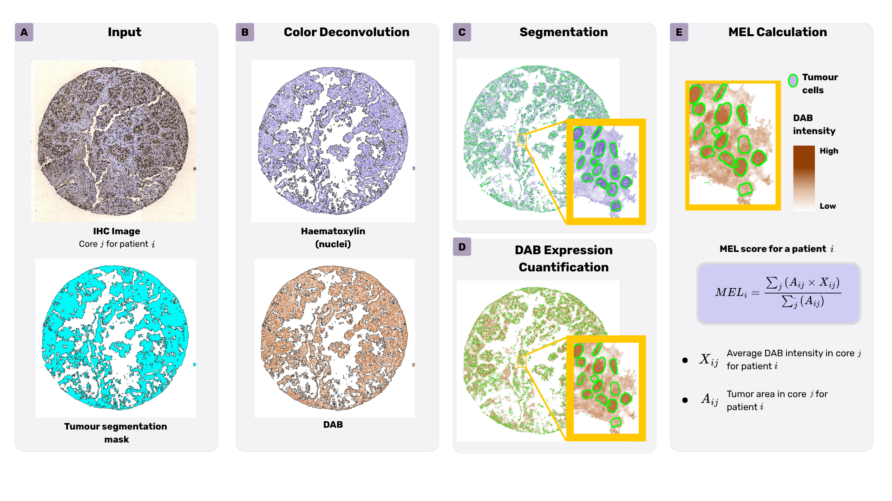
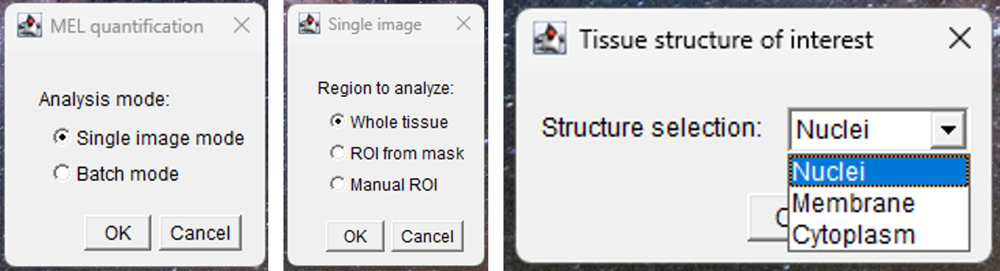
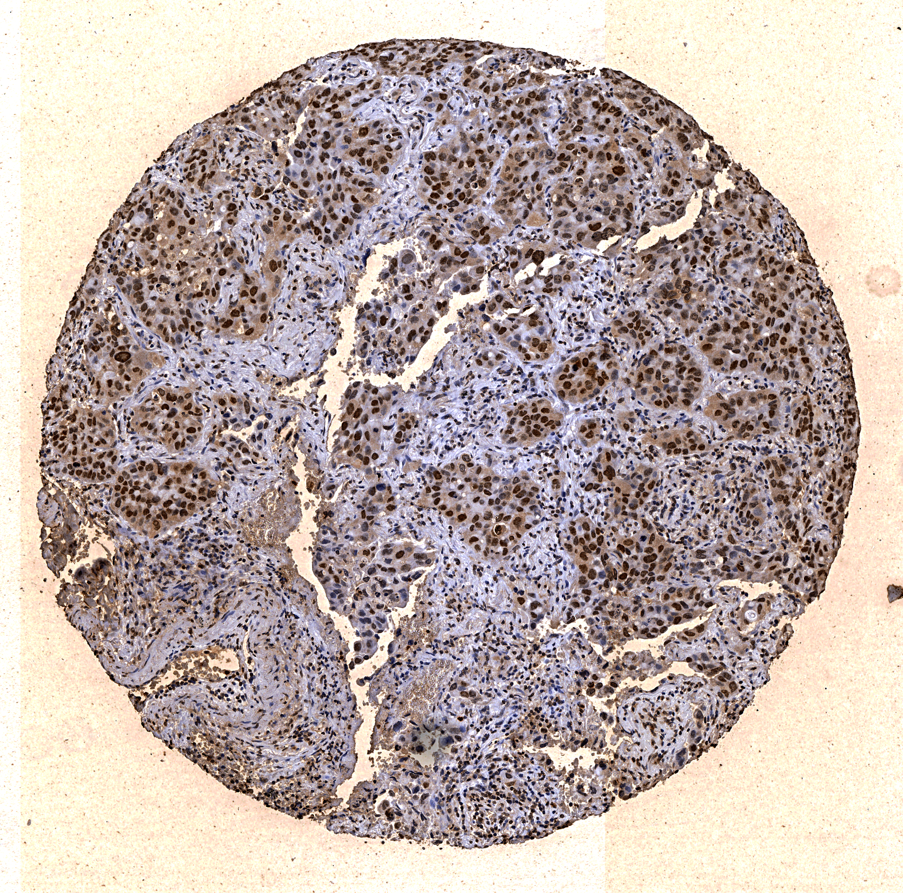
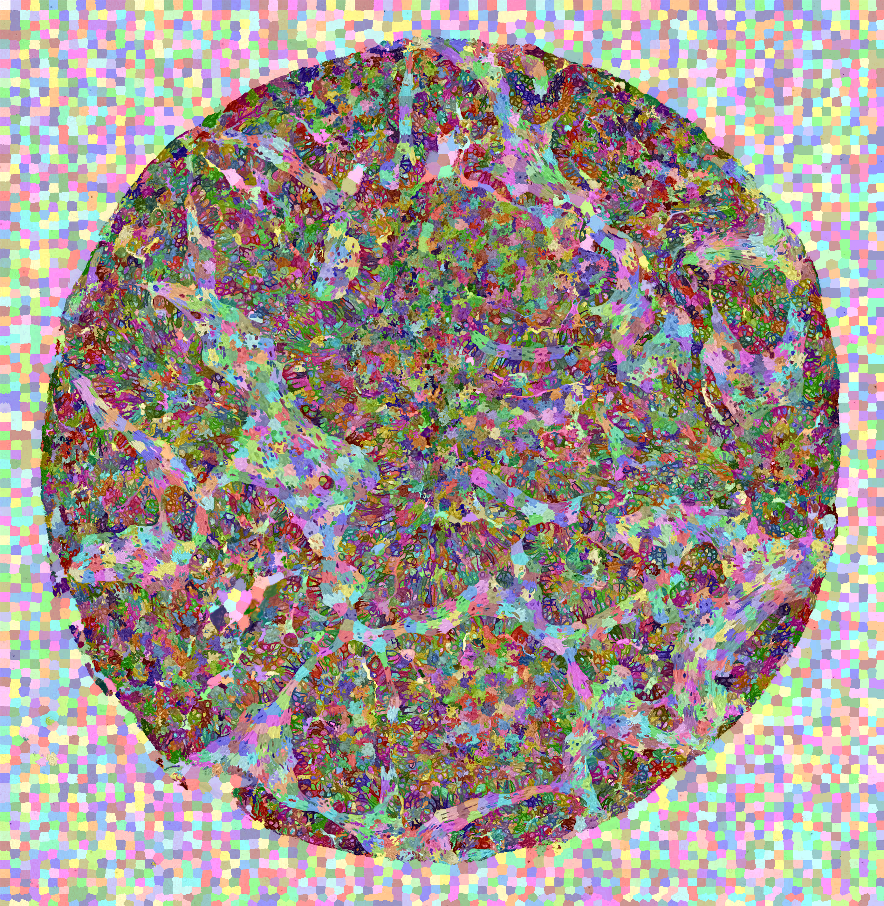
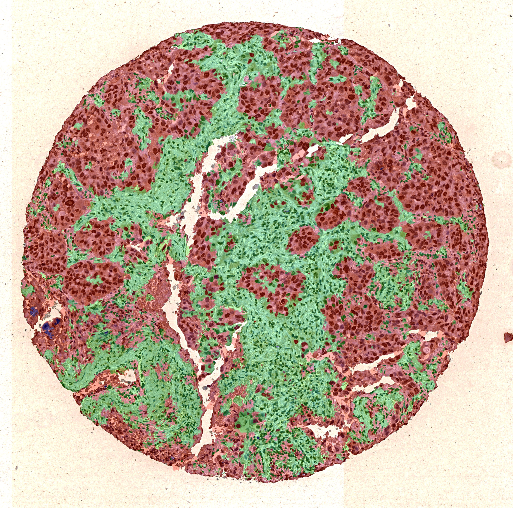

# MEL quantification

ImageJ/Fiji macros for quantifying marker expression level (MEL) in haematoxylin-DAB immunohistochemistry (IHC) images.

Within a user-defined tissue or region of interest, the workflow measures:

- the area occupied by a selected cellular compartment (nuclei, cytoplasm,
  or membrane); and
- the mean signal in the deconvolved DAB channel within that cellular compartment.

<div align="center">
  <table width="850" style="border-collapse: collapse; width: 850px;">
    <tr>
      <td align="center" bgcolor="#f6f8fa" style="border: 1px solid #d0d7de; padding: 0; line-height: 0;">
        
        <div bgcolor="#eaeef2" style="background-color: #eaeef2; border-top: 1px solid #d0d7de; border-left: 4px solid #9bb8d8; color: #24292f; line-height: 1.5; margin: 0; padding: 9px 14px; text-align: left;">
          <strong>Workflow overview.</strong>
          From the original RGB IHC image to region definition, colour
          deconvolution, compartment segmentation and MEL quantification.
        </div>
      </td>
    </tr>
  </table>
</div>

## What the method does

For each RGB IHC image, the workflow:

1. defines the region in which measurements are made;
2. separates haematoxylin and DAB with ImageJ's `H&E DAB` colour
   deconvolution vector;
3. segments the selected cellular compartment; and
4. measures compartment area and mean DAB intensity.

The method supports three cellular compartments: nuclei, cytoplasm and membrane.

## Measurement definition

For mask-based analyses, the area calculations are:

<div align="center">
  <p>
    <code>compartment area (μm<sup>2</sup>)</code>
    =
    <code>compartment area (pixels) × r<sup>2</sup></code>
  </p>
  <p>
    <code>compartment area (%)</code>
    =
    <code>100 × compartment area (μm<sup>2</sup>)</code>
    /
    <code>analysed-region area (μm<sup>2</sup>)</code>
  </p>
</div>

`r` is the image scale in micrometres per pixel. 

## Analysis modes

The launcher presents three choices:

| Choice | Options | Meaning |
|---|---|---|
| Analysis mode | Single image; Batch mode | Process one image or all matching images in a folder |
| Region to analyse | Whole tissue; ROI from mask; Manual ROI | Define the region used for cell segmentation and marker intensity measurement |
| Cell compartment | Nuclei; Cytoplasm; Membrane | Select the cell compartment to quantify |

The `run_GUI` launcher presents these choices through a sequence of dialogs:

<div align="center">
  
  <p><em>Example of the run_GUI selection windows for analysis mode, region and cell compartment.</em></p>
</div>

Manual ROI is available only in single-image mode. The macro selected by
the launcher is determined by these choices:

| Filename suffix | Input | Region definition | Processing |
|---|---|---|---|
| `_whole_tissue` | One original image | Automatic tissue threshold | Single image |
| `_tissue` | Folder of original images | Automatic tissue threshold | Batch |
| `_single` | One original image and one label mask | External ROI mask | Single image |
| `_ROI` | One original image | Freehand ROI drawn by the user | Single image |
| No suffix | Folder of images and folder of label masks | External ROI mask | Batch |

## Algorithm

### Nuclei

The macro thresholds the deconvolved haematoxylin channel, fills holes,
applies a median filter, and uses watershed to separate touching objects.
`Analyze Particles` then excludes objects outside the configured minimum
and maximum areas. The resulting nuclear ROI is used to measure nuclear
area and DAB intensity.

### Cytoplasm

The macro detects nuclei using the nuclear workflow and dilates the
nuclear ROI. Boolean operations between the selected tissue/ROI region
and the dilated nuclei produce the cytoplasmic ROI. Cytoplasm area and
mean DAB intensity are then measured in that ROI.

### Membrane

The macro generates seeds from local maxima in the haematoxylin channel
and from maxima in strongly DAB-positive regions. It applies a
marker-controlled watershed to the inverted DAB-derived edge image inside
the selected region. Watershed boundaries are eroded and filtered by
minimum object size before membrane area and mean DAB intensity are
measured.

## Input data

### Original IHC image

The original image is the RGB brightfield image containing haematoxylin
and DAB staining. It is the image from which the DAB measurement is made.

Required conditions:

- RGB format compatible with the `H&E DAB` deconvolution vector;
- `.tif` extension for batch mode (the current macros check for lowercase
  `.tif`);
- the same pixel dimensions as its label mask when mask mode is used; and
- a known pixel scale supplied through `Ratio micra/pixel`.

Do not use a deconvolved channel, a binary nuclei mask, or a JPEG quality
control overlay as the original image.

### External label map

An external mask is required only for **ROI from mask** mode. It must be a label
image in which pixel values represent regions such as background and the
region of interest. This can be any ROI selected for analysis; a typical use
case is a segmented tumour region.

For batch mask analysis, image and mask files must have exactly the same
filename and extension and must be stored in separate parallel folders:

```text
images/
|-- case_001.tif
`-- case_002.tif

masks/
|-- case_001.tif
`-- case_002.tif
```

## Use case: generating ROIs with Trainable Superpixel Segmentation

A typical workflow is to use [Trainable Superpixel Segmentation
(TSS)](https://github.com/CVPD/Trainable_Superpixel_Segmentation) in Fiji to
create the ROI mask, and then use MEL Quantification to measure marker
expression within that ROI. In the workflow described in the accompanying
article, TSS is used to segment tissue regions such as background, tumour,
stroma and immune infiltrate. The same approach can be used to define any
other region of interest.

The three images below show the main stages of this workflow:

<div align="center">
  <table width="100%" style="border-collapse: collapse; width: 100%;">
    <tr>
      <td align="center" valign="top" width="33%" style="padding: 8px; vertical-align: top;">
        
        <p><strong>Original IHC image</strong><br>
        RGB haematoxylin-DAB image used as the reference for the analysis and for final DAB quantification.</p>
      </td>
      <td align="center" valign="top" width="33%" style="padding: 8px; vertical-align: top;">
        
        <p><strong>Superpixel label map</strong><br>
        Numeric superpixel image generated before TSS classification. Each colour represents a different superpixel for visualization.</p>
      </td>
      <td align="center" valign="top" width="33%" style="padding: 8px; vertical-align: top;">
        
        <p><strong>TSS classification result</strong><br>
        Tissue regions classified by TSS and used to define the ROI for MEL Quantification.</p>
      </td>
    </tr>
  </table>
</div>

### 1. Generate a superpixel label image

Install TSS from its
[release page](https://github.com/CVPD/Trainable_Superpixel_Segmentation/releases)
and make sure that MorphoLibJ is available in Fiji. TSS expects:

1. the image to segment; and
2. a corresponding label image containing the generated superpixels.

The label image can be generated with a superpixel method such as SLIC. Open
both images in Fiji and run
`Plugins > Segmentation > Trainable Superpixel Segmentation`. Select
representative superpixels for each class, train the classifier, and apply it
to the image. For a tumour-oriented analysis, useful classes may include
background, tumour, stroma and immune infiltrate.

Save the resulting classification as a numeric label image with the same
dimensions as the original image. Select the label corresponding to the ROI
that should be quantified. For example, selecting the tumour class produces
the tumour ROI, but the selected class can represent any region of interest.

For a clearer visualization of the labels, use MorphoLibJ:

1. Select the numeric label image.
2. Run `Plugins > MorphoLibJ > Label Images > Labels To RGB`.
3. Save the resulting RGB image as a visualization of the superpixels or
   classified regions.

`Labels To RGB` assigns a distinct colour to each label, but its output is an
RGB visualization and must not replace the numeric label image. Keep both
files: use the numeric label image as the **Superpixel image** in TSS and as
the segmentation image in MEL Quantification. Use the RGB image only for
displaying the result in figures and quality-control overlays.

### 2. Quantify the ROI with MEL Quantification

Use the original RGB IHC image as the input for MEL Quantification, not the
preprocessed image or the superpixel label image. The preprocessing used to
help TSS segment tissue is only for defining the ROI; it must not replace the
original image used for DAB measurement.

For one image:

1. Launch `run_GUI` from the Fiji `Plugins` menu.
2. Select **Single image** and **ROI from mask**.
3. Select the original RGB image and the corresponding TSS label image.
4. Enter the label value assigned to the ROI and choose nuclei, cytoplasm or
   membrane.

For a batch, place the original images and TSS label images in separate
folders. Give each image and its label image exactly the same filename and
extension, then choose **Batch mode** and **ROI from mask** in `run_GUI`.

MEL Quantification then measures the selected cellular compartment and the
mean deconvolved DAB signal within the selected ROI. The ROI does not have to
be tumour tissue; tumour segmentation is simply a common use case.

## Parameters

The following are the parameters exposed by the current macros. Defaults
are starting values encoded in the scripts, not universal biological
constants.

| Parameter | Used by | Function | Default |
|---|---|---|---:|
| `Ratio micra/pixel` (`r`) | All variants | Converts pixel areas to um^2 | 0.5 |
| `ROI label` (`roiLabel`) | Mask variants | Label selected as the region of interest after the internal subtraction | 1 |
| `Nuclei threshold` (`thBlue`) | Nuclei, cytoplasm | Upper threshold on the deconvolved haematoxylin channel | 190 nuclei; 100 cytoplasm |
| `Nuclei threshold` (`thBlue`) | Membrane | Upper threshold used for haematoxylin seed generation | 140 |
| `Min nuclei size` (`minCellSize`) | Nuclei, cytoplasm | Minimum accepted nuclear particle area in pixels | 30 |
| `Max nuclei size` (`maxCellSize`) | Nuclei, cytoplasm | Maximum accepted nuclear particle area in pixels | 15000 |
| `Prominence for nuclei detection` (`prominence`) | Membrane | Prominence used by `Find Maxima` for seeds | 5 |
| `GLUT threshold` (`thBrown`) | Membrane | Threshold for strongly DAB-positive seed regions | 130 |
| `Min membrane size` (`minMembSize`) | Membrane | Minimum accepted membrane particle area in pixels | 50 |

## Outputs

The three mask-based batch macros have an active file-based export:

- `MEL Quantification/nuclei/nuclear.ijm`;
- `MEL Quantification/cytoplasm/cytoplasm.ijm`; and
- `MEL Quantification/membrane/membrane.ijm`.

They append one row per analysed image to
`QuantificationResults.xls`. Depending on the compartment, the table
contains:

- `Label`: original image filename;
- `ROI area (um2)`: area of the selected region of interest;
- `Nuclei area in ROI (%)`, `Cytoplasm area in ROI (%)`, or
  `Membrane area in ROI (%)`;
- `Iavg nuclei`, `Iavg cytoplasm`, or `Iavg membrane`; and
- additional classification fields in variants that implement them.

The output folders are created inside the selected mask directory:

```text
Quantification_results/
|-- QuantificationResults.xls
`-- case_001_analyzed.jpg
```

For cytoplasm:

```text
Quantification_results_cytoplasmic/
|-- QuantificationResults.xls
`-- case_001_analyzed.jpg
```

For membrane:

```text
Membrane_segmentations/
`-- case_001_membraneSegmentation.jpg
```

The JPEG files are quality-control overlays with the detected compartment
drawn in red over the original image. They are output figures, not input
label masks.

### Requirements

- Fiji with a current ImageJ 1.x installation;
- the Fiji **Colour Deconvolution** command; and
- **Marker-controlled Watershed** for membrane analysis. If unavailable,
  enable the MorphoLibJ update site in `Help > Update... > Manage update
  sites`, install it, and restart Fiji.

### Installation

The runnable macros are inside the repository's `MEL Quantification/`
directory. Clone or download this repository, then copy that complete
directory into Fiji's `plugins` directory (do not copy the repository root
directory):

```text
MEL_quantification/MEL Quantification/  ->  Fiji.app/plugins/MEL Quantification/
```

The resulting installation must have this layout:

```text
Fiji.app/plugins/MEL Quantification/
|-- run_GUI.ijm
|-- nuclei/
|-- cytoplasm/
`-- membrane/
```

Restart Fiji. The launcher appears in the `Plugins` menu as **run_GUI**.
Select it to open the MEL quantification analysis interface.
